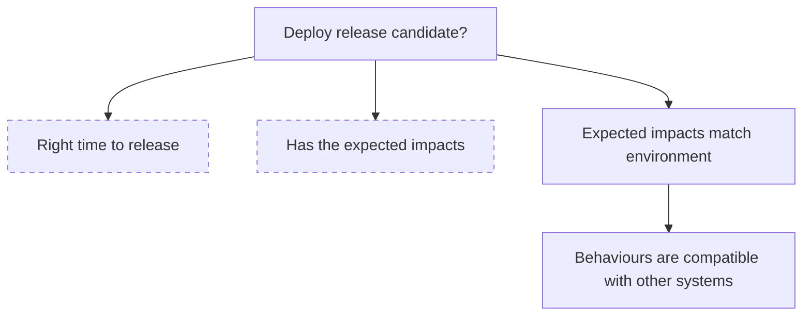
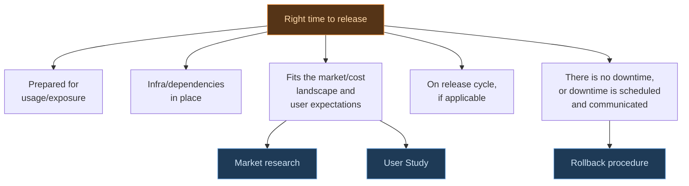
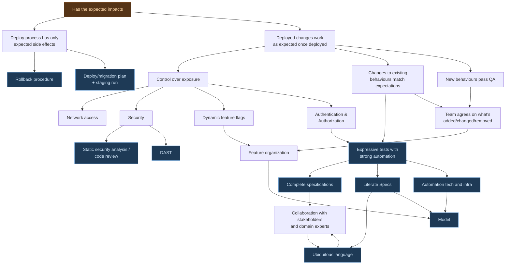

These decision-making flowcharts and the resulting checklist aim to answer a single question "should we release?".

Deploying large or small changes to production marks the end (of one iteration) of the SE Development/Data Analytics
lifecycle. Ultimately, bringing value to users by making technology accessible is one of if not the main driver for
iterating in the first place. Consequently, release decision making gates strongly inform the components that make up
high-quality software and analytics pipelines operating in the wild, and in turn the types of tools used to achieve it.

The aim here is to provide a comprehensive, generalized framework for any type of release - whether for a small or large
project, new features or infrastructure upgrades, initial product launch or iterative updates. The highest-risk
aspects of releases are the ones you don't think about; the checklist is your safety net to make sure you cover
all aspects of putting software into the world at every iteration, and is organized into a tree shape for clarity
and efficiency.

Below, you will find diagrams representing the release decision flow: chains of invariants and development lifecycle components or tools stemming from the primary release decision question.
Of course, these do not come for free: Use such tools in a way that matches your needs and
always make your own judgements about releasing. A node drawn with a dashed border is a
branch of its own, expanded in a later diagram.

Terms related to release are defined/expanded below the diagrams.
Please refer to the glossary (TODO) for our precise definitions of any other terms used.

## The Big Picture
The top-level of the checklist breaks down into a few large categories that can be assessed more-or-less independently. These align with the distinction between "building the right thing", and "building the thing right".

## Timing
This topic encompasses both the fit of the product with respect to the external world, as well as internal preparedness.

## Impacts
The biggest category, at least in depth, this discusses the actual changes being realized as a result of doing a release.

## Terms

*Release Candidate*: (RC) A snapshot of source code (including static configuration files and deployment scripts) being evaluated for release. Usually a tagged commit.

*Exposure*: Potential consequences of having the changes in the world. Includes cost from people using the software or legal implications.

*Infra(structure)*: Other resources controlled by you that must be present for the code to work. Usually these are cloud resources such as AWS S3 buckets, message brokers.

*Release Cycle*: A regular cadence, or specific times at which teams release or are allowed to release.

*Impacts*: Any results of releasing the RC. Include updating code running on servers, changing configurations, mutating cloud resources, and even
running scripts to manipulate data where appropriate. Adding/modifying (or removing) a feature is considered an impact. Making a website exist on
a domain that did not exist before is also an impact. So is fixing a bug.

*Downtime*: Any time where previously available and/or expected functionality are not available (even if no users try to use it). Commonly this is a
service outage where a server cannot be reached but there are other examples such as where a bug makes a feature inaccessible or not work properly.

*Rollback*: Reverting deployed instances to the previous release candidate - effectively removing the effects of the release. This is typically done
when a release immediately causes downtime once deployed and a previous release candidate is considered stable.

*QA*: Testing done on **net-new** behaviours and other release impacts, whether by humans or by bots, mostly to glue together stakeholder expectations
and actual developed results. QA can be done by a developer if they are the stakeholder. Although the terms is used quite broadly in the industry,
for the purposes of this framework we exclude regression testing and other types of release checks. We instead deal with changes to existing behaviours
in a separate branch of the tree.

*Existing Behaviours*: Things the software does as of the last stable release. These are what users already or come to expect, and include behaviours
that may not be intended. Unintended behaviours should largely be avoided by following a structured design and specification process.

*Feature Organization*: The team's system for defining what is a feature. Vertical slicing is one possible system. The idea is to have units of behaviour that can be individually tested and be turned on or off (see feature flags). It's important to have a model for this.

*Model*: An external blueprint of the software, graphical or otherwise. It's common for the model to describe the *shape* of the software while not describing its *texture*. Software models are extremely useful for design, collaboration, testing, and even describing a system to builder agents
(see more in the Design module). Event models are a strong example that highlight information flow.

*Expressive Tests*: Tests whose source code - or data, in the case of something like Gherkin/Cucumber - tell lots about what they do and, by extension, what the software does. These give confidence to stakeholders, serve as executable specifications, and prove to us why they even exist
(not something that can be said for many tests that exist in industry codebases).

*Strong Automation*: Test automation that ensures the test actually tests what it says, and gets deep enough that we get confidence even without
actually using the software ourselves. One of the strongest automation is E2E tests using Playwright - since they test fully integrated flow - but
of course those are relatively expensive and are not the only type of strong automation. Getting this right relies on good technology and infrastructure
that effectively separates business logic from wiring.

*Literate Specification*: Descriptions about software shape and behaviour that are well-organized, and can be
understood by everyone on the team. Require a good model.

*Complete Specification*: Descriptions about software shape and behaviour that eliminate as much uncertainty as possible. Must capture everything that
stakeholders expected - current, and ideally going into the future as well.

*Ubiquitous Language*: Terms, phrases, ways of communicating that are collaboratively built up between domain experts, stakeholders, and developers.
As basic as it sounds, the goal is for everyone on the team to be able to talk. Developers should use the language of the business when naming things,
asking questions, and interpreting tests. You can learn more about this from the DDD community.

[Propose an improvement](https://github.com/TrilemmaFoundation/microproduct-lab/pulls)
